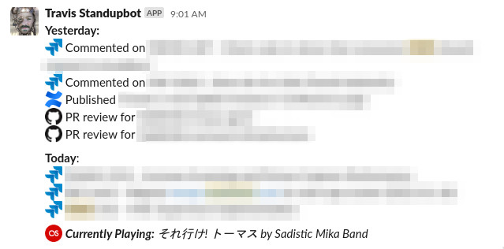

# Slack Standup Bot
My personal Slack Standupbot

- What I did yesterday: Jira already knows that (See `graphql.json.in`)
- What I'm doing today: Jira already knows that (See `jql.json.in`)
- What I'm currently listening to: [Last.fm](https://www.last.fm/user/TambayKano) already knows that too!

## Example

